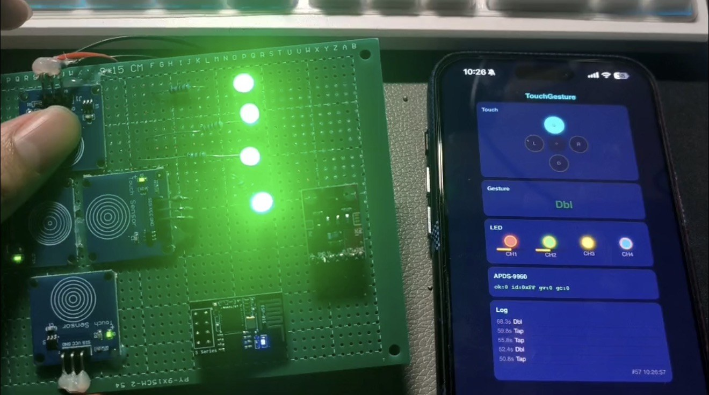

# STM32 触摸与隔空手势控制系统

[](https://github.com/rongyishuaige7/stm32-touch-gesture-control-system/actions/workflows/firmware.yml)
[](LICENSE)

一个基于 STM32F103C8T6 的智能家电交互教学原型：使用四路 TTP223 识别单击、双击、长按和触摸滑动，使用 APDS-9960 识别隔空手势，控制四路 LED，并由 ESP-01S 建立本地 Wi-Fi 热点和 HTTP 状态页。

> **项目状态（2026-07-17）：** 源码来源已确认，源码契约与 PlatformIO 干净构建已通过；**当前 STM32、TTP223、APDS-9960、ESP-01S 和 LED 整机尚未重新真机复测**。当前没有公开实物照片、演示视频、EDA、PCB 或制造文件。

## 历史素材证据（2026-07-18 发布）

已脱敏的历史照片和历史 EDA 衍生文件。日期、脱敏处理、未公开材料和证据边界见 [MEDIA_EVIDENCE](docs/MEDIA_EVIDENCE.md)。



历史照片、截图或 EDA 不证明当前公开提交已烧录或完成真机复测。**当前未进行真机复测。**


## 系统结构

```text
TTP223 × 4 ── GPIO ──┐
                     │
APDS-9960 ─── I²C ───┼─→ STM32F103C8T6 ─→ PWM LED × 2
                     │                   └→ 开关 LED × 2
                     │
                     └─ USART1 → ESP-01S（AT 固件）
                                           │
                               SoftAP + HTTP 状态页 / JSON API
```

这是源码推导的结构说明，不是 PCB 原理图，也不表示硬件当前在线。

## 学习内容

- 四路 TTP223 输入、软件消抖和多键状态解析；
- 单击、双击、长按和左右触摸滑动状态机；
- APDS-9960 FIFO 轮询、方向差分与手势判定；
- TIM3 双通道 PWM 调光和两路 GPIO 开关输出；
- ESP8266 AT 指令、环形接收缓冲区与 `+IPD` 解析；
- 受限 RAM 环境下分块发送嵌入式 HTML；
- 本地 SoftAP、HTTP 状态页面和 JSON 诊断接口。

## 交互映射

| 输入 | 条件 | 动作 |
| :-- | :-- | :-- |
| TTP223 单击 | 上/下或左/右短按 | 切换 LED1 或 LED2 |
| TTP223 双击 | 200 ms 内同键再次按下 | 切换 LED3 或 LED4 |
| TTP223 长按 | 持续至少 1.5 秒 | 全部关闭并进入非阻塞演示序列 |
| TTP223 左右滑动 | 左右键在 300 ms 内相继触发 | LED1 亮度增减 10% |
| APDS-9960 上下/左右 | FIFO 手势判定 | LED1 亮度增减 10% |

所有阈值和 PWM 步进都是源码固定的教学参数，不是经过人体工学或产品可用性测试的结论。

## 硬件与引脚

| 模块/信号 | STM32F103 引脚 | 说明 |
| :-- | :-- | :-- |
| TTP223 上/左/右/下 | PA0 / PA1 / PA2 / PA3 | 高电平有效，输入下拉 |
| LED1 / LED2 | PA6 / PA7 | TIM3 CH1/CH2 PWM |
| LED3 / LED4 | PB0 / PB1 | GPIO 推挽输出 |
| APDS-9960 SCL / SDA | PB6 / PB7 | I²C1，7 位地址 `0x39` |
| ESP-01S TX/RX | PA10 / PA9 | USART1，115200 baud |
| SWD | PA13 / PA14 | ST-Link 烧录调试 |

接线前请阅读 [HARDWARE.md](HARDWARE.md)、[BOM](hardware/BOM.csv) 和[接线边界图](hardware/wiring-diagram.svg)。ESP-01S 需要稳定的 3.3 V 供电并与 STM32 共地；不要用 STM32 GPIO 直接驱动超出额定电流的灯或负载。

## 本地热点与接口

固件通过 ESP-01S 建立**教学用本地热点**：

```text
SSID: TouchGesture
Password: 12345678
Address: http://192.168.4.1
```

这组值是公开的示例热点配置，不是用户真实 Wi-Fi 凭据。它只适合隔离的桌面教学环境；如用于现场演示，应在 `include/config.h` 中更换为独立密码后重新编译。

| 接口 | 返回内容 |
| :-- | :-- |
| `GET /` | 嵌入式状态页 |
| `GET /api/state` | 触摸、手势、LED、亮度与 APDS 摘要 |
| `GET /api/diag` | APDS 初始化、FIFO 与方向差分诊断 |

HTTP 没有认证、TLS、会话或设备身份，且启用了 `Access-Control-Allow-Origin: *`。不要桥接到公网、校园网或不可信局域网。

## 构建

已验证基线：PlatformIO Core 6.1.19、`ststm32@19.5.0`、STM32CubeF1 1.8.6。

```bash
git clone https://github.com/rongyishuaige7/stm32-touch-gesture-control-system.git
cd stm32-touch-gesture-control-system
bash scripts/verify.sh
```

直接构建或通过 ST-Link 烧录：

```bash
pio run
pio run -t upload
```

CI Artifact 仅保留 14 天，是构建证据，不是已经在某块硬件上验证过的产品固件。

## 目录

```text
include/                 引脚、阈值和模块头文件
src/                     触摸、手势、APDS、LED、ESP 与主循环
hardware/                BOM 和接线边界图
scripts/                 敏感信息、仓库结构和一键门禁
tests/                   不依赖硬件的源码契约检查
docs/                    来源、协议、状态、验证和元数据
platformio.ini            固定版本的 PlatformIO 工程
```

## 当前公开范围与限制

- 当前只证明源码结构、关键契约和固定环境构建；没有证明烧录、触摸可靠性、APDS 识别率、ESP AT 固件兼容性或 HTTP 运行；
- 没有当前实物照片、演示视频、EDA、PCB、Gerber 或制造文件；
- APDS 方向算法使用有限样本与固定阈值，没有准确率、距离、环境光或误触评估；
- HTTP 发送和部分 APDS 读取会阻塞主循环，不适合实时或安全控制；
- 内置 Web 页面是状态观察入口，不是远程控制接口；
- 未知路径会返回真实 HTTP 404，但本项目未实现更完整的请求方法和输入安全模型；
- 固件使用 HSI 8 MHz，不启用 PLL，PlatformIO 板卡元数据中的 72 MHz 不是本项目运行时钟证据。

完整边界见[项目状态](docs/PROJECT_STATUS.md)和[验证说明](docs/VERIFICATION.md)。

## 许可证与教学使用

Rongyi 原创源码使用 [MIT License](LICENSE)。PlatformIO、STM32Cube 和工具链等第三方依赖的来源与许可证见 [THIRD_PARTY_NOTICES.md](THIRD_PARTY_NOTICES.md)。

欢迎用于课程实验、毕业设计参考和个人学习，但不要把本仓库或其文档原样冒充自己的课程设计、毕业设计或竞赛成果。引用重要代码、架构或文档时，请遵守许可证并注明来源。
